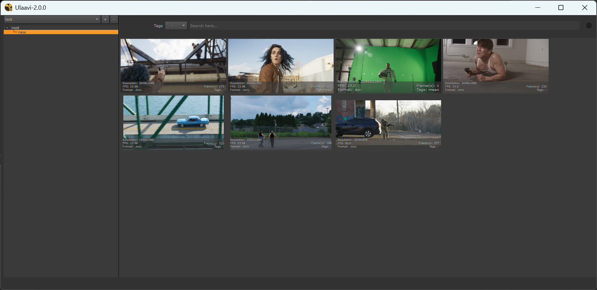

# Ulaavi - Stock Footage Loader for Nuke

Ulaavi is a tool designed to help you load, preview, and import stock footage directly inside Nuke. It simplifies the process of working with stock footage by providing an intuitive interface and high-quality previews.

---

## Preview


## Features
- Load and preview stock footage directly in Nuke.
- High-quality `.mov` previews (replaced GIF previews in ver-2.0.0 for better quality).
- Seamless integration with Nuke's workflow.

---

## Installation

### Prerequisites
- **FFmpeg**: Ensure FFmpeg is installed and its directory is added to your system's environment path.
- **Third-Party Packages**:
  - `clique==2.0.0`
  - `opencv-python==4.11.0.86`
  - `numpy==1.26.4`
  - `Pyside2` or `PySide6` (depending on your Nuke version).

### Steps
1. Install the required third-party packages using pip:
   ```bash
   pip install clique==2.0.0 opencv-python==4.11.0.86 numpy==1.26.4
   ```
   or to install in a specific path
   ```bash
   pip install --target <TARGET_PATH_TO_INSTALL> clique==2.0.0 opencv-python==4.11.0.86 numpy==1.26.4
   ```
3. Append Package Path to init.py in the .nuke Folder
    ```python
    import sys
    sys.path.append("PACKAGE_PATH_TO_APPEND")
    ```
4. #### Install FFmpeg - On Windows:
   * ###### Download FFmpeg:
      1. Go to the official FFmpeg website: https://ffmpeg.org/download.html.
      2. Scroll down to the "Windows" section and download the latest static build (e.g., ffmpeg-release-full.7z).
    * ###### Extract the Files:
      1. Extract the downloaded .7z file using a tool like 7-Zip.
      2. Extract the contents to a directory, e.g., C:\ffmpeg.
    * ###### Add FFmpeg to System Environment Variables:
      1. Add the FFmpeg bin directory inside the extracted FFmpeg directory to your system's environment (e.g., C:\ffmpeg\bin).
         
5. Append Ulaavi tool path to init.py in the .nuke Folder.
     ```python
     import nuke
     nuke.pluginAddPath("ULAAVI_TOOL_PATH")
     ```

### Compatibility
* Tested and working in Nuke 15 and Nuke 16.
* <b>No backward compatibility</b> with older versions of Nuke.

### Platforms
* Tested in Windows (may work in Linux & Mac)

### What's Changed
* GIF previews have been replaced with .mov for better quality previews.
* Added basic and essential metadata preview over thumbnails.
* Removed restrictions to add categories in more depth.
* Removed support for .nk and mesh files.
* Removed List view.
* No backward compatibility with older versions of the tool.
* <b>Tested in Nuke 15 and Nuke 16 (Windows)</b>.

### Usage
* Launch Ulaavi from the Nuke toolbar or menu.
* Browse and select your stock footage.
* Preview the footage directly in the Ulaavi interface.
* Import the footage into your Nuke script.

### Notes
* Ensure all dependencies are installed correctly to avoid runtime errors.
* For any issues or feature requests, please contact the developer.

### License
Ulaavi is provided under the MIT License.
